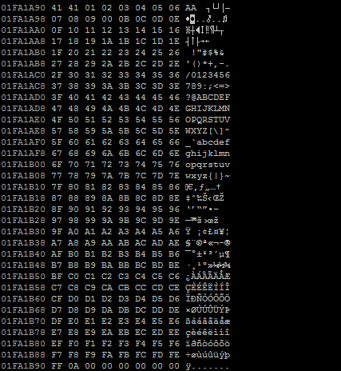
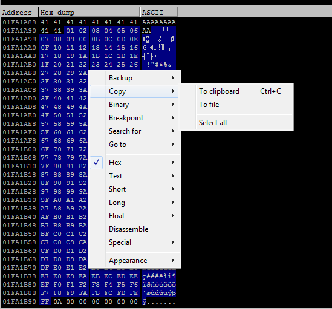
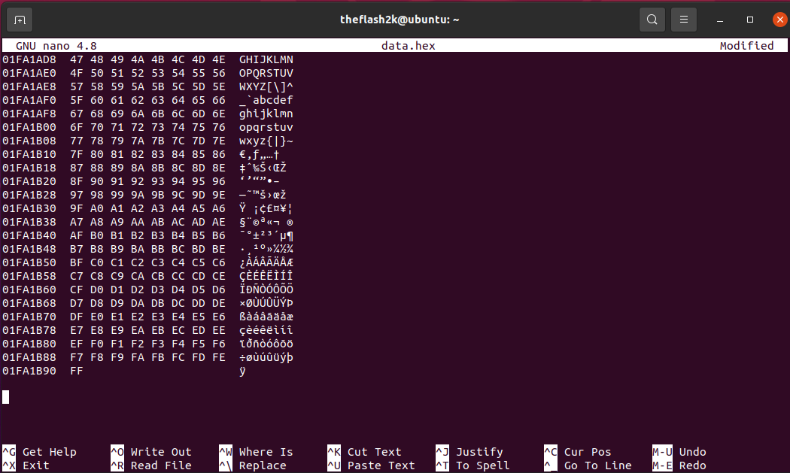
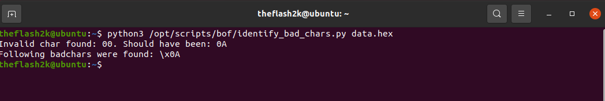

# Some random bof scripts for ease
A combination of some scripts that may assist during OSCP Buffer Overflow.

## address_to_hex.py
To use this script is pretty simple, all we need is just to copy the address and then pass that address an argument. Basic usage:
```bash
python3 address_to_hex.py 0x12312312
```
- Output : `\x12\x23\x31\x12`

Note: I do know that i can use struct to actually convert the address to raw bytes
but i prefer using stuff that i create myself idk ;--;
If you don't know about how to do that using struct (you can also use pwntools and p32 function)
```python
import struct
struct.pack('<I', 0x123123)
# '<I' here represents the little endian format
```

## get_bad_chars.py
This script is the easiest to use. It simply prints all the badchars (including null-byte (0x00)) onto the terminal as a variable. The 'b' prefix has also been added to each line so that it's easier when using python3.
Usage:
```bash
python3 get_bad_chars.py
```
- Output:

```bash
badchars = (
b"\x00\x01\x02\x03\x04\x05\x06\x07\x08\x09\x0a\x0b\x0c\x0d\x0e\x0f\x10\x11\x12\x13\x14\x15\x16\x17\x18\x19\x1a\x1b\x1c\x1d\x1e\x1f"
b"\x20\x21\x22\x23\x24\x25\x26\x27\x28\x29\x2a\x2b\x2c\x2d\x2e\x2f\x30\x31\x32\x33\x34\x35\x36\x37\x38\x39\x3a\x3b\x3c\x3d\x3e\x3f\x40"
b"\x41\x42\x43\x44\x45\x46\x47\x48\x49\x4a\x4b\x4c\x4d\x4e\x4f\x50\x51\x52\x53\x54\x55\x56\x57\x58\x59\x5a\x5b\x5c\x5d\x5e\x5f\x60\x61"
b"\x62\x63\x64\x65\x66\x67\x68\x69\x6a\x6b\x6c\x6d\x6e\x6f\x70\x71\x72\x73\x74\x75\x76\x77\x78\x79\x7a\x7b\x7c\x7d\x7e\x7f\x80\x81\x82"
b"\x83\x84\x85\x86\x87\x88\x89\x8a\x8b\x8c\x8d\x8e\x8f\x90\x91\x92\x93\x94\x95\x96\x97\x98\x99\x9a\x9b\x9c\x9d\x9e\x9f\xa0\xa1\xa2\xa3"
b"\xa4\xa5\xa6\xa7\xa8\xa9\xaa\xab\xac\xad\xae\xaf\xb0\xb1\xb2\xb3\xb4\xb5\xb6\xb7\xb8\xb9\xba\xbb\xbc\xbd\xbe\xbf\xc0\xc1\xc2\xc3\xc4"
b"\xc5\xc6\xc7\xc8\xc9\xca\xcb\xcc\xcd\xce\xcf\xd0\xd1\xd2\xd3\xd4\xd5\xd6\xd7\xd8\xd9\xda\xdb\xdc\xdd\xde\xdf\xe0\xe1\xe2\xe3\xe4\xe5"
b"\xe6\xe7\xe8\xe9\xea\xeb\xec\xed\xee\xef\xf0\xf1\xf2\xf3\xf4\xf5\xf6\xf7\xf8\xf9\xfa\xfb\xfc\xfd\xfe\xff"
)
```

## identify_bad_char.py:
This script is the most useful amongst all of the above as most people (including me) tend to miss out atleast a single bad character and then generate a shell code that would cause problems later on. So, what I simply did is made everything a little bit more easier.

Usage:
```bash
python3 identify_bad_char.py dump.hex
```
The `dump.hex` file refers to the dump from immunity debuffer.
You need to store the data dump from immunity debugger into a file, and just pass that specific file as an argument when calling this. Check the following screenshots for a better clarification as to how to use this script.

Step 1:
- You need to find the vulnerable point in your program and find the offset and then send badchars.


Step 2:
- Once you've sent the bad chars, select from 0x01 to 0xFF (Only select these characters otherwise the script won't work properly). Once you've selected these, right click, copy, copy to clipboard (Alternatively, you can use CTRL + C shortcut as well).


Step 3:
- Now, we will come to our linux machine (or windows, will work on both). We will create a new file (I will call it data.hex) and then we'll paste the dump in that file. Then we'll save it.


Step 4:
- Just run the script now and pass the file as an argument and we will have the script tell us about the badchars.

